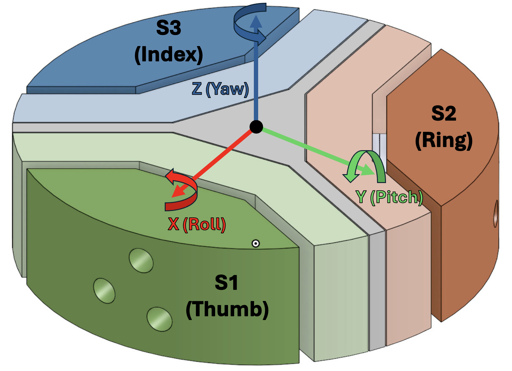

# Finger Manipulation Experiment Protocol
Force Sensor 1(NIDAQ): FT44298  
Force Sensor 2(NIDAQ): FT45281  
Force Sensor 3(Labjack): FT44297  

Finger positioning for each finger
<ul>
    <li> Thumb for Sensor 1</li>
    <li> Index for Sensor 3</li>
    <li> Middle for Sensor 2</li>
</ul>
For position sensor calibration:
<ul>
    <li> Thumb for Sensor 1</li>
    <li> Index for Sensor 3</li>
    <li> Middle for Sensor 2</li>
</ul>

 
For data access, please refer to:
`data/{rotation axis}/test_{number}`

The data structure of `raw_data.csv` is: 
$\textbf{[}S_1-F_x, S_1-F_y, S_1-F_z, S_1-\tau_x, S_1-\tau_y, S_1-\tau_z,$ 
$S_2-F_x, S_2-F_y, S_2-F_z, S_2-\tau_x, S_2-\tau_y, S_2-\tau_z,$ 
$S_3-F_x, S_3-F_y, S_3-F_z, S_3-\tau_x, S_3-\tau_y, S_3-\tau_z \textbf{]}$

The data structure of `transformed_data.csv` is: 
$\textbf{[}S_1-F_x, S_1-F_y, S_1-F_z, S_1-\tau_x, S_1-\tau_y, S_1-\tau_z,$ 
$S_2-F_x, S_2-F_y, S_2-F_z, S_2-\tau_x, S_2-\tau_y, S_2-\tau_z,$ 
$S_3-F_x, S_3-F_y, S_3-F_z, S_3-\tau_x, S_3-\tau_y, S_3-\tau_z \textbf{]}$

While these components are <strong>zeros</strong>: 
 $\textbf{[}S_1-\tau_x, S_1-\tau_y, S_1-\tau_z,$ 
$S_2-\tau_x, S_2-\tau_y, S_2-\tau_z,$ 
$S_3-\tau_x, S_3-\tau_y, S_3-\tau_z \textbf{]}$

A PCA script can be found in `data_analysis.ipynb`. 
When performing PCA on combined force and torque data, `StandardScaler` is applied prior to PCA to normalize the feature scales. 
For force-only analysis, scaling is disabled to preserve the physical magnitude relationships.

## Finger Force to Finger Position Frame Calculations
Fingers 1 & 2 refer to `NIDAQ_ATI_publisher.py`  
Finger 3 refer to `Labjack_ATI_publisher.py`
<b><i>
 Finger Force 1 to Finger  Postion 1 Rotations: </b>  
</i> 
 
<b>Ffinger1</b>
=(
RTbase←finger1
Rbase←obj
Rforce2'←force1'(120°)
Robject←force1'
Rforce1'←force1(48°)
)
Fforce1
<b><i>
 Finger Force 2 to Finger Position 2 Rotations:</b>  
</i>
 
<i><b>Ffinger2</b>
=(
RTbase←finger2
Rbase←obj
Rforce2'←force2'(0°)
Robject←force2'
Rforce2'←force2(48°)
)
Fforce2 </i>
<b> <i> 
 Finger Force 3 to Finger Position 3 Rotations: </b>
</i> 
 
    <li> Case 1: Includes Rx(180°) to account for large polhemus sensor   </li>

</i> 
 
<i><b>Ffinger3</b>
=(
Rx(180°)
RTbase←finger3
Rbase←obj
Rforce2'←force3'(-120°)
Robject←force3'
Rforce3'←force3(48°)
)
Fforce3 </i>

<li> Case 2:Without Rx(180°)  

</i> 
 
<i><b>Ffinger3</b>
=(
RTbase←finger3
Rbase←obj
Rforce2'←force3'(-120°)
Robject←force3'
Rforce3'←force3(48°)
)
Fforce3 </i>

## Finger Force to Object Origin Frame Calculations
Refer to `ObjectOrigin_ATI_publisher.py`
<b><i>
Finger Force 1 & Torque 1 to Object Origin Frame Rotation:</b></i>

<b>Fobj_origin₁</b> = Robj_origin←force(42°) Fforce₁&nbsp;&nbsp;&nbsp;  
<b>τobj_origin₁</b> = Robj_origin←torque(42°) τtorque₁

<b><i>
Finger Force 2 & Torque 2 to Object Origin Frame Rotation:</b></i>

<b>Fobj_origin₂</b> = Robj_origin←force(42°) Fforce₂&nbsp;&nbsp;&nbsp;  
<b>τobj_origin₂</b> = Robj_origin←torque(42°) τtorque₂

<b><i>
Finger Force 3 & Torque 3 to Object Origin Frame Rotation:</b></i>

<b>Fobj_origin₃</b> = Robj_origin←force(42°) Fforce₃&nbsp;&nbsp;&nbsp;  
<b>τobj_origin₃</b> = Robj_origin←torque(42°) τtorque₃

<b><i>
Contact Point Solution (θ, h):</b></i>

Given <b>Fobjecti</b> = (fx′, fy′, fz′) and <b>τobjecti</b> = (τx′, τy′, τz′):  
φ = atan2(fx′, fz′)  
θi = arcsin( −(l·fx′ + τy′) / (R·√(fx′²+fz′²)) ) + φ  
hi = H + (τz′ − fy′·R·sin θi) / fx′

where l is the fixed lever offset from sensor origin to object origin, <i>R</i> is the object (cylinder) radius, and <i>H</i> is the sensor origin height offset.

<b><i>
Finger Force to Contact Frame Rotation:</b></i>

<b>Fcontacti</b> = Rcontact←object(θi) Fobjecti

Rcontact←object(θ) =
[ 0&nbsp;&nbsp;&nbsp;1&nbsp;&nbsp;&nbsp;0 ;
−cos θ&nbsp;&nbsp;&nbsp;0&nbsp;&nbsp;&nbsp;sin θ ;
sin θ&nbsp;&nbsp;&nbsp;0&nbsp;&nbsp;&nbsp;cos θ ]

## Error Calculations
For finger to object refer to `relative_rotational_error_node.py` 
For finger to base refer to `rotational_error_node.py`

<b><i> 
 Calibrating Finger Postion Sensor to Object Postion Sensor Rotations: </b> 
</i> 
 
<i><b>Rfinger←object</b>
=RTbase←finger
Rbase←object

 
<b>Error</b>
=tr(
Rfinger←object
)
− 3 </i>
<b><i>
 Calibrating Finger Position Sensor to Polhemus Base Rotations: </b>  
</i> 
 
<i><b>Rerror</b>
=RTGT
Rbase←sensor 

 
<b>Error</b>
=tr(
Rerror
)
− 3

## Reference 

